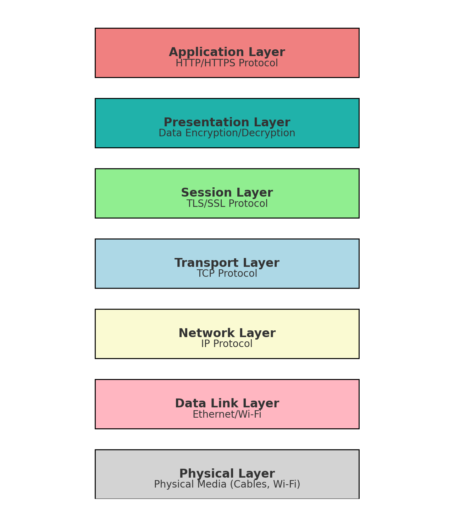
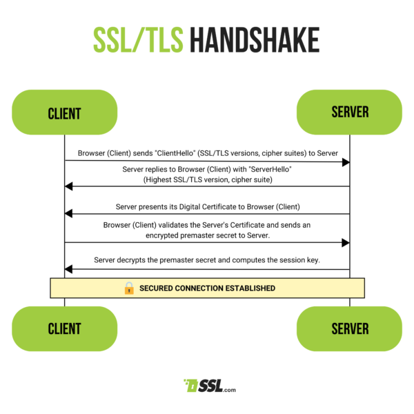

# HTTPS & SSL/TLS

## What is HTTPS?
HTTPS (Hypertext Transfer Protocol Secure) is an extension of HTTP designed to secure data transmitted over the internet. It achieves this by incorporating SSL/TLS protocols, which encrypt the communication between a user's browser and a web server. HTTPS uses port 443 by default instead of HTTP's port 80.  
> **HTTP + SSL/TLS = HTTPS**

The HTTPS protocol is essential for protecting sensitive information such as credit card numbers, banking information, and login credentials from being intercepted by malicious parties.

  
*HTTPS Layer Structure*

*Instagram OAuth requires `HTTPS`*  

## What is SSL/TLS

SSL (Secure Sockets Layer) and its successor, TLS (Transport Layer Security), are cryptographic protocols that provide secure communication over a network. These protocols play a critical role in HTTPS by ensuring that data sent between a client (like a web browser) and a server is encrypted and secure.

### How SSL/TLS Encryption Works
SSL/TLS employs two types of encryption:

- **Asymmetric Encryption (Public Key Cryptography)**:
  - In the initial stages of communication, SSL/TLS uses asymmetric encryption, where a pair of keys—public and private—are used. The public key is used to encrypt data, which can only be decrypted by the corresponding private key. This ensures that only the intended recipient, who holds the private key, can read the data.

- **Symmetric Encryption**:
  - After the initial handshake, SSL/TLS switches to symmetric encryption for the actual data transfer. Both the client and server use the same session key to encrypt and decrypt data. Symmetric encryption is faster and more efficient for transmitting large amounts of data.

### The SSL/TLS Handshake Process
The SSL/TLS handshake is a process that establishes a secure connection between the client and server. Here’s how it works:

1. **Client Hello**:
   - The client initiates the process by sending a "hello" message to the server, listing the SSL/TLS versions and cipher suites it supports, along with a random number.

2. **Server Hello**:
   - The server responds with its own "hello" message, selecting the SSL/TLS version and cipher suite to be used, and provides its SSL/TLS certificate, which includes the server's public key.

3. **Authentication and Pre-Master Secret**:
   - The client verifies the server's certificate using a trusted Certificate Authority (CA). The client then generates a pre-master secret, encrypts it with the server's public key, and sends it to the server.

4. **Session Key Generation**:
   - Both the client and server use the pre-master secret to generate the same session key. This session key is then used to encrypt all subsequent data exchanged during the session.

5. **Client Finished**:
   - The client sends a message encrypted with the session key, indicating that the handshake process is complete on its end.

6. **Server Finished**:
   - The server sends its own encrypted message to signal that the handshake is complete, and the secure session is now established.

### Why SSL/TLS Matters
- **Encryption**: SSL/TLS ensures that all data transmitted between the client and server is encrypted and secure.
- **Authentication**: The server's identity is verified through certificates, ensuring that data is being sent to the right party.
- **Data Integrity**: SSL/TLS protects the integrity of the data, ensuring that it has not been tampered with during transmission.

####References
[HTTPS](https://www.ssl.com/faqs/what-is-https/)  
[SSL/TLS](https://www.ssl.com/article/what-is-ssl-tls-an-in-depth-guide/)  
[SSL/TLS Handshake](https://www.ssl.com/article/ssl-tls-handshake-ensuring-secure-online-interactions/)