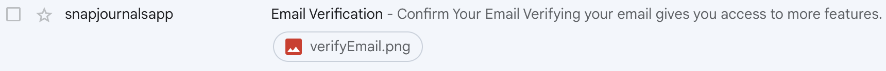

# Enhancing Email Design - Nodemailer

The emails being sent to users were too simple, so I decided to improve the design using CID (Content-ID) to embed images directly into the email. In Nodemailer, you can only use simple HTML with inline CSS.
  
### Embedding Local Images Using CID
To improve the visual appeal of the emails, I used CID to embed local images into the email content.

```js
// config/email.js
.
.
const sendEmail = async (to, subject, html, attachments = []) => {
  const mailOptions = {
    from: process.env.EMAIL_USER,
    to,
    subject,
    html,
    attachments: attachments.length > 0 ? attachments : undefined, // Attachments are optional.
  };
.
.
// emailService.js
.
.
  const verificationLink = `${process.env.FRONTEND_URL}/verify-email?token={token}`;
  const emailHtml = `
  <div style="font-family: Arial, sans-serif; max-width: 400px; margin: auto; padding: 20px; text-align: center; border: 1px solid #ddd; border-radius: 10px;">
    
    <h1 style="color: #333;">Confirm Your Email</h1>
    <p style="color: #555;">Verifying your email gives you access to more features. <br /> Click the button below to confirm your email address.</p>
    <a href="${verificationLink}" style="display: inline-block; padding: 15px 25px; color: #fff; background-color: #3498db; border-radius: 5px; text-decoration: none;">Confirm Email</a>
    <p style="color: #999; font-size: 12px; margin-top: 30px;">If you did not request this email, you can safely ignore it.</p>
  </div>
  `;
.
.
```
ssue with Gmail Showing Images as Attachments

Although these codes generally work, the .png file is still visible as an attachment in Gmail.  

  
--

**I also tried using an image buffer and an Imgur URL, but the same problem persists.**  

```js
const sendEmail = async (to, subject, html, imageUrl = null, cid = 'defaultImageCid') => {
  let attachments = [];

  if (imageUrl) {
    const response = await axios.get(imageUrl, { responseType: 'arraybuffer' });
    const imageBuffer = Buffer.from(response.data, 'binary');

    // Add the image to attachments
    attachments.push({
      content: imageBuffer,
      cid: cid,
      contentType: 'image/png',
    });
  }
```
--
### Base64 Encoding
Successfully loaded the image on Naver email. but Gmail didn't loaded the image.  

```js
const fs = require('fs');

const encodeImageToBase64 = (imagePath) => {
  return fs.readFileSync(imagePath, 'base64');
};
```  
--
### MIME(Multipurpose Internet Mail Extensions)
MIME is a standard that defines the content format of email. Initially, email could only transmit simple text, but MIME allows for the inclusion of various media types (images, videos, audio, applications, etc.).  
If the email client doesn't support the HTML Content, MIME provides a fallback to text content.  

```js
  const textContent = `
    Welcome to our service! Please confirm your email by visiting the following link: ${verificationLink}
  `

  const htmlContent = `
  <div style="font-family: Arial, sans-serif; max-width: 400px; margin: auto; padding: 20px; text-align: center; border: 1px solid #ddd; border-radius: 10px;">
    
    <h1 style="color: #333;">Confirm Your Email</h1>
    <p style="color: #555;">Verifying your email gives you access to more features. <br /> Click the button below to confirm your email address.</p>
    <a href="${verificationLink}" style="display: inline-block; padding: 15px 25px; color: #fff; background-color: #3498db; border-radius: 5px; text-decoration: none;">Confirm Email</a>
    <p style="color: #999; font-size: 12px; margin-top: 30px;">If you did not request this email, you can safely ignore it.</p>
  </div>`

```
---
Therefore, using MIME provides significant advantages for my project, delivering flexibility and robust support for different content types in emails. Additionally, by uploading images to Imgur, I can easily embed them into the HTML content using URLs, streamlining the process of including images in emails.

### References
- [Embedding Images in Nodemailer Using CID](https://www.educative.io/answers/how-to-embed-image-using-nodemailer)  
- [Nodemailer](https://nodemailer.com/message/embedded-images/)  
- [Base64 Encoding](https://dev.to/dnature/convert-a-base64-data-into-an-image-in-node-js-3f88)