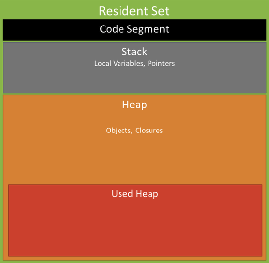

# Memory Leak

## Work Details
Customize Strapi's override plugin `users-permissions` for exact message for Register. [Strapi Official Github](https://github.com/strapi/strapi/blob/v4.25.2/packages/plugins/users-permissions/server/controllers/auth.js#L293). But it occurs memory leak problem.

### What is Memory Leak?
A memory leak occurs when a program mismanages memory allocation, causing unused memory to remain allocated and preventing it from being reclaimed. In Node.js, which relies heavily on asynchronous, non-blocking I/O operations, identifying and resolving memory leaks is an essential skill for developers.

### Memory Management in Node.js
In Node.js, memory management is crucial for ensuring optimal performance and efficiency. The V8 JavaScript engine, developed by Google and used by Node.js, employs automatic memory management through a process known as garbage collection.



1. Heap
The heap is a region of memory used for the dynamic allocation of objects during the runtime of a program. In Node.js, the heap is where objects, closures, and other dynamically allocated data reside.  
The V8 engine divides the heap into two main segments: the young and old generation. Objects initially start in the young generation and are promoted to the old generation if they survive multiple garbage collection cycles.  

2. Stack
The stack, in contrast to the heap, is a region of memory used for the execution of function calls and management of local variables. Node.js creates a new frame on the stack, containing information about the function's local variables, parameters, and return address. The stack operates in a last-in, first-out (LIFO), with each function call's frame being pushed onto the stack and popped off when the function completes.

3. Memory Allocation  
In Node.js memory allocation occurs when variables and objects are dynamically created during the execution of a program. When you create an object, the V8 engine allocates memory for that entity on the heap. The engine employs various memory allocation algorithms, including:  
	- Bump-Pointer Allocation: Allocates memory by moving a pointer up the heap, and when it reaches the end, it triggers garbage collection.
	- Free List Allocation: Allocates memory from a list of free memory chunks, reusing previously allocated space.

4. Garbage Collection  
Garbage collection is the process of identifying and reclaiming memory occupied by objects that are no longer in use. In Node.js the V8 engine employs a generational garbage collector.  
This collector divides objects into the young generation (where short-lived objects are allocated) and the old generation (where longer-lived objects are promoted). Garbage collection cycles, such as Scavenge for the young generation and Mark-Sweep-Compact for the old generation, help reclaim memory by identifying and collecting unused objects.


## Issues
Here's the code


```js
module.exports = (plugin) => {
  plugin.controllers.auth.register = async (ctx) => {
    const { email, username } = ctx.request.body;

    try {
      const existingUser = await strapi.query('plugin::users-permissions.user').findOne({
        where: {
          $or: [{ email }, { username }],
        },
      });

      if (existingUser) {
        if (existingUser.email === email) {
          return ctx.badRequest('Email is already taken');
        } else if (existingUser.username === username) {
          return ctx.badRequest('Email or username are already taken');
        }
      }

      const defaultRegister = strapi.plugins['users-permissions'].controllers.auth.register;
      await defaultRegister(ctx);
    } catch (error) {
      console.error('Error during registration', error);
      return ctx.badRequest('Registration failed due to server error');
    }
  };

  return plugin;
};
```

## Solution

`const defaultRegister = strapi.plugins['users-permissions'].controllers.auth.register;` The register method from the auth controller of the users-permissions plugin. However, this is happening inside the function. This means that on every call register, a new reference to defaultRegister is being created, which could lead to unnecessary memory consumption.

Because the reference is being re-assigned on every call, the garbage collector may not be able to efficiently free the memory associated with these references. As a result, memory usage keeps growing with each request, which leads to a memory leak.

```js
module.exports = (plugin) => {
  const originRegister = plugin.controllers.auth.register;

  plugin.controllers.auth.register = async (ctx) => {
    const { email, username } = ctx.request.body;
    // console.log('Strapi info', email, username);

    const existingEmailUser = await strapi.query('plugin::users-permissions.user').findOne({
      where: { email: email.toLowerCase() }
    });

    if (existingEmailUser) {
      return ctx.badRequest('Email already exists.');
    }

    await originRegister(ctx);
  };
  return plugin;
}
```


## References
[Node.js Official Site](https://nodejs.org/en/learn/diagnostics/memory)  
[Node.js-Memory Leaks](https://www.netguru.com/blog/node-js-memory-leaks)  