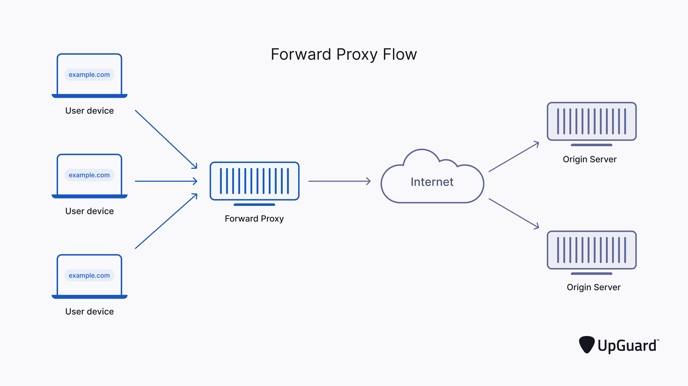
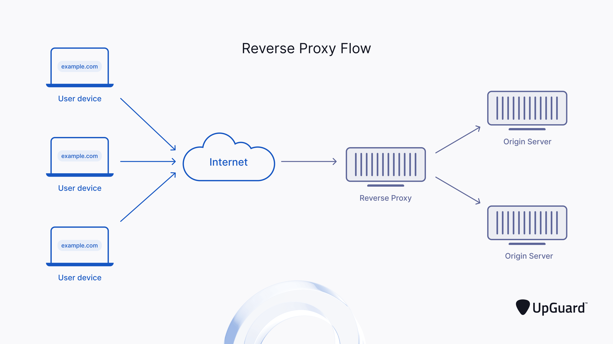

# Proxy

## What is Proxy
A proxy server is a system or router that provides a gateway between users and the internet. and intermediary server that retrieves data from an Internet source, such as a webpage. They act as additional data security boundaries protecting users from malicious activity on the internet.  

## Types of Proxy Servers
There are many different types of proxy servers such as Anonymous Proxy, SIP Proxy, etc... But in this document, let's talk about only `Forward Proxy Server` and `Reverse Proxy Server`.  

### 1. Forward Proxy Server
>A forward proxy, often simply referred to as a "proxy," acts as an intermediary between users on an internal network and the internet. It is typically used to pass requests from users through a firewall to the broader internet.  

  
#### How It Works
- **Request Handling**: When a user requests access to a website or other internet resources, the forward proxy evaluates the request. Depending on its configuration, it can either allow or deny the request.
- **Firewall Interaction**: If the request is allowed, the forward proxy forwards it through the firewall to the appropriate web server. The web server's response is then sent back to the proxy, which in turn relays it to the user.
- **Caching**: Before retrieving information from the web server, the forward proxy checks if the requested data is already cached. If the data is cached, the proxy serves it directly to the user, saving time and bandwidth.
- **Denying Requests**: If the proxy denies the user's request, it will send back an error message or redirect the user to another page.

### 2. Reverse Proxy Server
>A reserve proxy is a type of proxy server that typically passes requests from the Internet through to users in an internal network via a firewall.  

  
#### How It Works
- **Request Handling**: When a user on the internet requests access to a resource hosted on an internal server, the reverse proxy handles the request. It can restrict or monitor access to sensitive data on the internal servers.  
- **Firewall Interaction**: If the reverse proxy allows the request, it forwards it through the firewall to the appropriate internal server. The server's response is then sent back to the proxy, which in turn relays it to the user.  
- **Caching**: Like forward proxies, reverse proxies also check for cached information before retrieving data from the server. If the data is cached, the proxy sends it directly to the user.  
- **Denying Requests**: If the proxy denies the request, it sends the user an error message or redirects them as necessary.
  
  
#### Reference
[Proxy](https://www.upguard.com/blog/proxy-server)