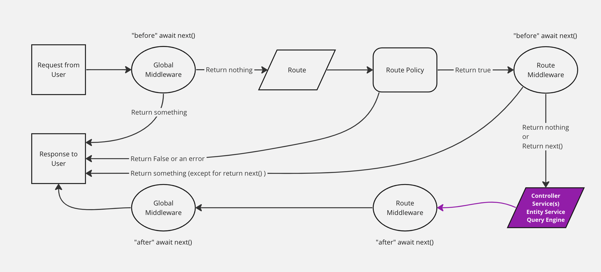

# Strapi customization 
-
Simple Version of Strapi Flow



### Custom Controller - Define the custom API Endpoint by Controller files
-
Solved using this method.

On the SignUpPage, if Email or Username already exists in the backend, the error Email or Username are already taken occurs. However, I want to separate these and provide distinct error messages. Customize the API Endpoint to return these specific messages.
<br />

Typically, the folder structure for customizing an API Endpoint is as follows:

```markup
/api
	/<api-name>
		/config
			/routes.json
		/controllers
		/routes
		/services
```

Example structure for auth:

```markup
/api
	/auth
		/config
			/routes.json
		/contollers
			/auth.js
		/routes
			/auth.js
		/services
			/auth.js
```

### config/routes.json vs routes/auth.js
---
#### config/routes.json  
- Manages global settings for the project.
- Defines common routes used across the entire application.
- Defines basic CRUD routes for main resources (e.g., articles, users).

#### routes/auth.js
- Defines routes for specific plugins or feature modules.  
- Sets up routes related to authentication and authorization.  
- Specifies endpoints for login, logout, registration, etc.  
- Integrates with controllers handling user management and authentication logic.

For this implementation, write in routes/auth.js.

#### Controllers

- Handle the logic for HTTP requests.
- Can call logic created in services.

#### Services

- Contain reusable business logic.
- Include database queries or other reusable logic.

##### *In backend/config/plugins.js, activate plugins and set JWT token expiration.  

config/plugins.js  

```js
module.exports = () => ({
  'users-permissions': {
    enabled: true,
    config: {
      jwtSecret: process.env.JWT_SECRET,
      jwt: {
        expiresIn: '7d',
      },
    },
  },
});
```  
api/auth/controllers/auth.js (Controllers)  

```js
'use strict';

const { sanitize } = require('@strapi/utils');

module.exports = {
  async register(ctx) {
    const { username, email, password } = ctx.request.body;

    if (!username || !email || !password) {
      return ctx.badRequest('Missing username, email or password');
    }

    const emailExist = await strapi.query('plugin::users-permissions.user').findOne({ where: { email } });
    const usernameExist = await strapi.query('plugin::users-permissions.user').findOne({ where: { username } });

    if (emailExist && usernameExist) {
      return ctx.badRequest('Email and Username are already taken');
    }
    
    if (emailExist) {
      return ctx.badRequest('Email is already taken');
    }

    if (usernameExist) {
      return ctx.badRequest('Username is already taken');
    }

    const user = await strapi.plugins['users-permissions'].services.user.add({
      username,
      email,
      password,
    });

    const sanitizeUser = await sanitize.contentAPI.output(user, strapi.getModel('plugin::users-permissions.user'));

    ctx.send(sanitizeUser);
  },
};

```
  
### Reference
- [Strapi-Document](https://docs.strapi.io/dev-docs/backend-customization/controllers)
- [SnapJournal-commit_b1ec5c2](https://github.com/Tae-uni/snapjournal/commit/b1ec5c28ff01b342d59ecf782a565fc7d7fbdca3)